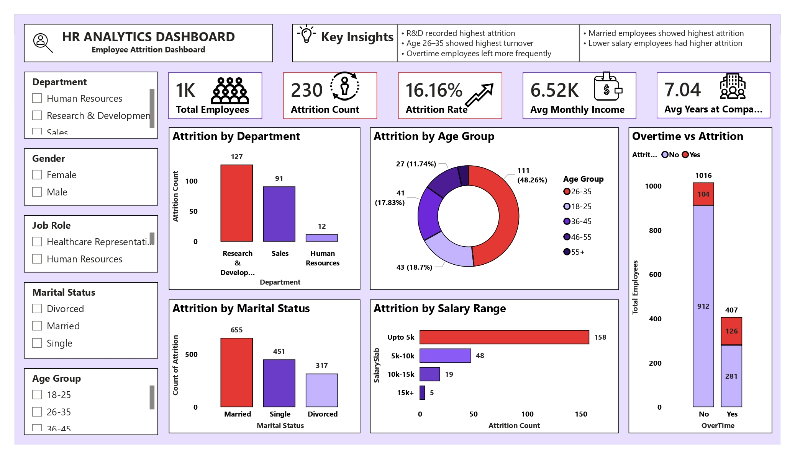

# HR Analytics Dashboard

## Project Overview

This Power BI dashboard analyzes employee attrition, workforce demographics, and employee behavior to support data-driven HR decision-making.

## Dashboard Preview

## Tools Used

* Power BI
* Excel
* Data Visualization
* Data Cleaning

## Dashboard Features

* Employee Attrition Analysis
* Department Attrition Trends
* Age Group Analysis
* Overtime vs Attrition
* Salary Range Analysis
* Marital Status Insights
* Interactive Filters and KPI Cards

## Key Insights

* Research & Development recorded the highest attrition
* Employees aged 26–35 showed the highest turnover
* Overtime employees had higher attrition rates
* Lower salary employees showed higher attrition
* Married employees recorded the highest attrition count

## KPIs Included

* Total Employees
* Attrition Count
* Attrition Rate
* Average Monthly Income
* Average Years at Company

## Files Included

* [Power BI Dashboard](Employee_Attrition_Analytics_Dashboard.pbix)
* 
* [Dataset](HR_Analytics.csv)
